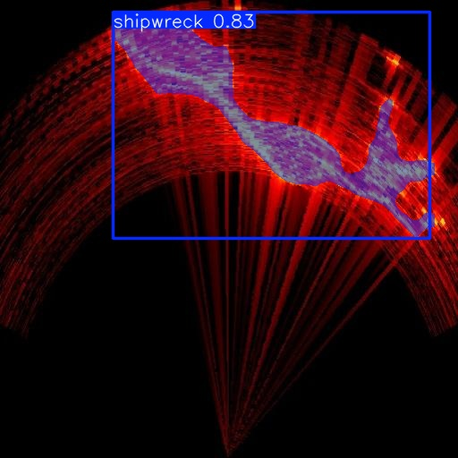
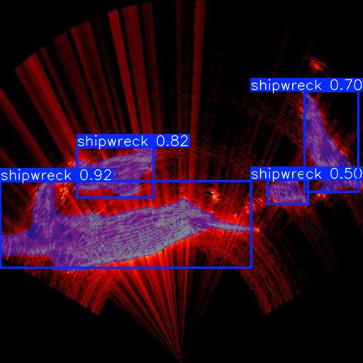
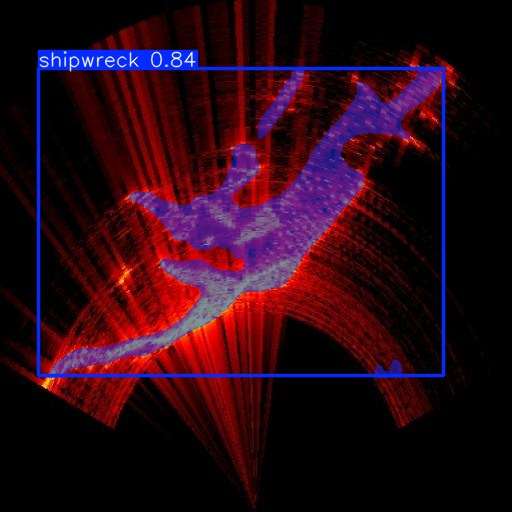
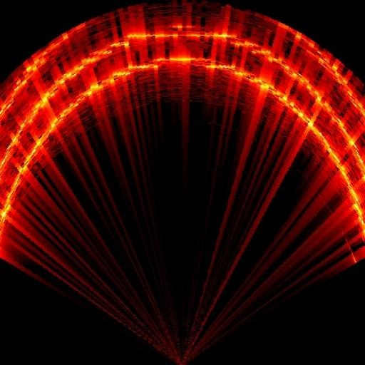
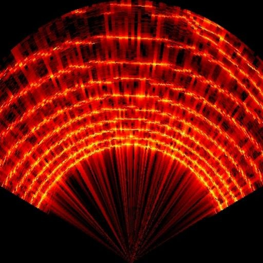
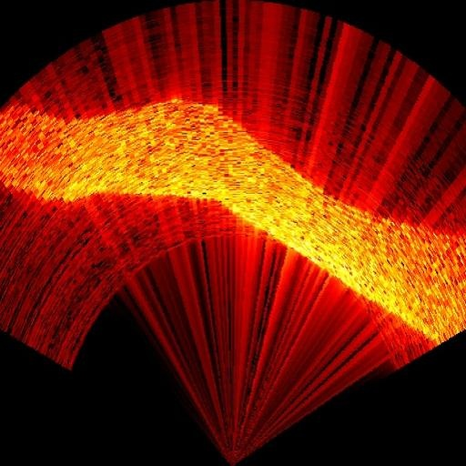

# DAVE 水下声呐沉船识别

中文 | [Русский](README.ru.md)


本项目整理了 DAVE / BlueROV2 多波束声呐仿真、RViz 可视化、网页虚拟摇杆操作，以及 YOLOv8-seg 声呐沉船实时识别的必要文件。识别节点只订阅声呐图像并发布带标注图像，**不会发布摇杆、MAVROS 或推进器控制指令**。

> **项目阶段：** 第一阶段完成声呐沉船识别验证。演示视频和单帧识别结果见下方。

## 是否需要激活 Python 虚拟环境？

- 启动仿真世界和 RViz：**不需要**激活 YOLO Python 虚拟环境。启动脚本会加载 ROS 2 Jazzy 和 DAVE 工作区。
- 启动 YOLO 实时识别：需要一个能同时导入 ROS Python (`rclpy`、`sensor_msgs`) 和 YOLO/PyTorch 的 Python 环境。你目前已验证可用的 `~/venv-dave-stage1` 可以继续用；运行识别脚本时它会自动激活。不要为了启动世界而激活它。

## 环境前提

此仓库不包含 ROS、Gazebo、DAVE、ArduPilot 或训练数据。先在 WSL Ubuntu 24.04 安装并构建 ROS 2 Jazzy、DAVE 官方工作区及 ArduPilot/Gazebo 插件。启动脚本预期工作区在：

- `~/dave_ws`
- `~/dave_ws_official`
- ArduPilot SITL 在 `~/ardupilot`
- `~/venv-ardupilot`

如果你的工作区路径不同，请先调整 `start_dave_official.sh` 中相应的环境设置。

## 启动世界和 RViz

在 WSL 终端进入克隆后的项目目录：

```bash
bash ./start_dave_and_rviz.sh
```

脚本先启动 DAVE 世界，等潜水器里程计话题出现后再打开 RViz。默认会运行解锁状态守护；若不需要该功能：

```bash
KEEP_ARMED=0 bash ./start_dave_and_rviz.sh
```

停止时在启动终端按 `Ctrl+C`。也可以单独启动世界或 RViz：

```bash
bash ./start_dave_official.sh
bash ./open_dave_rviz.sh
```

## 网页虚拟摇杆

打开 [DAVE Virtual Joystick](https://ioes-lab.github.io/dave/extras/virtual_joystick.html)，确认页面显示 `Connection Connected`。常用操作：

| 操作 | 功能 |
|---|---|
| A | STABILIZE 模式 |
| Y | ALT_HOLD 深度保持模式 |
| MENU | ARM 解锁 |
| VIEW | DISARM 上锁 |
| 左摇杆上下/左右 | 前进后退 / 左右平移 |
| 右摇杆上下/左右 | 上浮下潜 / 左右转向 |
| B / X | 增大 / 减小推力输出 |

## YOLO 实时声呐识别

先启动 DAVE 世界并确认声呐图像话题正在发布。使用当前已经装好 YOLO、CUDA 和 ROS Python 依赖的虚拟环境启动（脚本会自动激活 `~/venv-dave-stage1`）：

```bash
bash ./run_sonar_yolo_realtime.sh
```

当前已验证环境：PyTorch `2.6.0+cu124`、CUDA 可用、RTX 4070 Laptop GPU、NumPy `1.26.4`、OpenCV `4.11.0`、Ultralytics `8.4.171`。Windows 上安装 CUDA 并不等于 WSL Python 能使用 CUDA；以脚本打印的 `WSL PyTorch CUDA` 状态为准。不要为这个项目盲目重装 PyTorch。

节点会读取：

```text
/model/bluerov2_heavy_multibeam_sonar/multibeam_sonar/sonar_image
```

并发布：

```text
/dave_yolo/annotated
```

在 RViz 添加 `Image` 显示并选择 `/dave_yolo/annotated`，即可看识别结果。也可以用 ROS 图像查看工具订阅该话题。默认推理上限 2 Hz、输入尺寸 512、置信度阈值 0.47；可覆盖参数，例如：

```bash
bash ./run_sonar_yolo_realtime.sh --rate 1 --imgsz 512 --conf 0.47 --device auto
```

按 `Ctrl+C` 停止。**识别结果目前不控制潜水器。**

## 模型与限制

- 权重：[`models/shipwreck_seg_v1-5_best.pt`](models/shipwreck_seg_v1-5_best.pt)，YOLOv8 分割模型，类别只有 `shipwreck`。未检出沉船不等同于识别出一个明确的“背景类别”。
- 原训练数据没有随仓库发布。训练数据来自 Roboflow 项目，数据集页面标注为 CC BY 4.0；见下方署名说明。
- 这是基础实验模型，可能漏检或误检。测试前应在 RViz 中观察真实输出，不要将它视作安全/导航系统。

## 第一阶段成果与声呐识别示例

### 沉船：触发 `Shipwreck` 分割

以下是 YOLO 对沉船声呐图像的识别输出，掩膜和置信度由模型生成。

<table>
  <tr>
    <td align="center"><br><sub>样例 1 · 置信度 0.83</sub></td>
    <td align="center"><br><sub>样例 2 · 多个区域触发</sub></td>
    <td align="center"><br><sub>样例 3 · 置信度 0.84</sub></td>
  </tr>
</table>

### 沙丘：空标签背景，不触发检测

训练标注中沉船标为 `Shipwreck`，沙丘样本则作为空标签背景。因此这些沙丘声呐帧没有检测框/分割掩膜。这表示模型没有输出已训练类别，并不代表模型单独识别或理解了“沙丘”。

<table>
  <tr>
    <td align="center"><br><sub>沙丘背景 · 无检测输出</sub></td>
    <td align="center"><br><sub>沙丘背景 · 无检测输出</sub></td>
    <td align="center"><br><sub>沙丘背景 · 无检测输出</sub></td>
  </tr>
</table>

### 演示视频

[`media/test_shipwreck.mp4`](media/test_shipwreck.mp4) 展示了接入 YOLO 后实时识别沉船的过程。

视频通过 Git LFS 存储。克隆仓库后需要安装 Git LFS 并执行 `git lfs pull` 才能取回视频内容；GitHub 的普通 Git 单文件限制为 100 MiB，而该视频约 169.5 MiB。LFS 下载会计入仓库所有者的 Git LFS 带宽额度。

## 数据与第三方内容署名

训练数据集：**My First Project**, `nothingbeatyous-workspace`, version 1，Roboflow Universe，CC BY 4.0：
[数据集页面](https://universe.roboflow.com/nothingbeatyous-workspace/my-first-project-4vdi4/dataset/1)。模型由该数据集训练得到。依 CC BY 4.0 要求保留署名、许可链接并说明修改/衍生；若再分发数据或模型，请同时提供本说明。

场景文件引用了 DAVE / Fuel 的第三方仿真资源；请同时遵守各资源原始仓库与模型文件中的许可。DAVE、ROS 2、Gazebo、ArduPilot、Ultralytics 及 PyTorch 均为各自项目所有，本仓库不重新许可这些第三方软件。项目自有代码的独立许可尚未指定。

## 内容范围

仓库只保留运行所需的脚本、世界/RViz 配置、实时识别代码、模型权重和 `media/test_shipwreck.mp4` 这一阶段性演示视频；不包含虚拟环境、原始数据集、训练日志、其他视频、RL 检查点或用户机器上的绝对路径配置。
